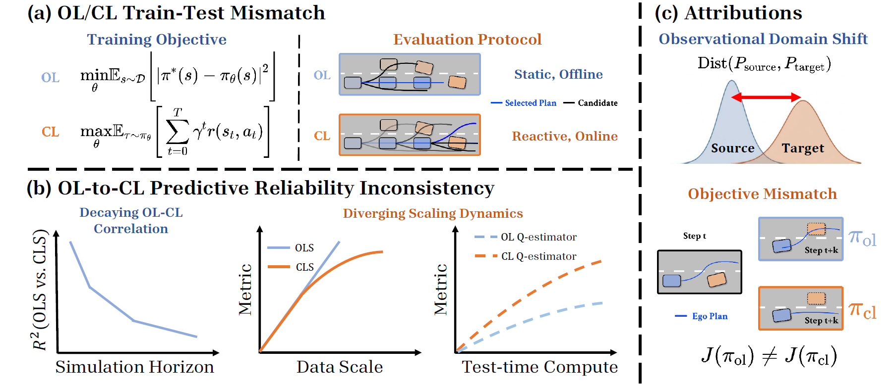

# BridgeSim: Unveiling the OL-CL Gap in End-to-End Autonomous Driving

[](https://vail-ucla.github.io/BridgeSim/)
[](https://arxiv.org/abs/2604.10856)
[](https://huggingface.co/sethzhao506ucla/BridgeSim)

[Seth Z. Zhao*](https://sethzhao506.github.io)<sup>1</sup>, [Luobin Wang*](https://scholar.google.com/citations?user=rbmtcYsAAAAJ&hl=en)<sup>2</sup>, [Hongwei Ruan](https://www.linkedin.com/in/hongwei-ruan/)<sup>2</sup>, [Yuxin Bao](www.linkedin.com/in/rebecca-bao-c13752hz)<sup>1</sup>, [Yilan Chen](https://yilanchen6.github.io)<sup>2</sup>, [Ziyang Leng](https://scholar.google.com/citations?user=Lwz4be0AAAAJ&hl=en)<sup>1</sup>, [Abhijit Ravichandran](https://www.linkedin.com/in/rabhijit/)<sup>2</sup>, [Honglin He](https://dhlinv.github.io)<sup>1</sup>, [Zewei Zhou](https://scholar.google.com/citations?user=TzhyHbYAAAAJ&hl=zh-CN)<sup>1</sup>, [Xu Han](https://scholar.google.com/citations?user=Ndgk55IAAAAJ&hl=en)<sup>1</sup>, [Abhishek Peri](https://www.linkedin.com/in/abhishek-peri/)<sup>3</sup>, [Zhiyu Huang](https://mczhi.github.io)<sup>1</sup>, [Pranav Desai](https://www.linkedin.com/in/pndesai2/)<sup>3</sup>, [Henrik Christensen](https://scholar.google.com/citations?user=MA8rI0MAAAAJ&hl=en)<sup>2</sup>, [Jiaqi Ma](https://mobility-lab.seas.ucla.edu/about/)<sup>1</sup>, [Bolei Zhou](https://boleizhou.github.io/)<sup>1</sup>†

<sup>1</sup>UCLA &nbsp;&nbsp; <sup>2</sup>UCSD &nbsp;&nbsp; <sup>3</sup>Qualcomm

\* Equal contribution &nbsp;&nbsp; † Corresponding author




BridgeSim is a cross-simulator closed-loop evaluation platform for end-to-end autonomous driving policies, built on the [MetaDrive](https://github.com/metadriverse/metadrive) simulator. It supports evaluating models trained on NavSim and Bench2Drive across multiple real-world datasets (NavSim, Waymo, nuScenes, and more). BridgeSim provides a unified evaluation interface that bridges the gap between training-time datasets and deployment-time environments, enabling fair and reproducible benchmarking across diverse driving scenarios.

## News

- **`2026/04`**: BridgeSim paper and codebase release.

## ✅ Currently Supported Features

- [√] Closed-loop evaluation of NavSim models (DiffusionDrive, DiffusionDriveV2, LTF, TransFuser, DrivoR) on multiple datasets
- [√] Closed-loop evaluation of Bench2Drive models (UniAD, VAD) on multiple datasets
- [√] Closed-loop evaluation of RAP on multiple datasets
- [√] Scenario conversion from OpenScene / NavSim, Bench2Drive, nuScenes, and Waymo to ScenarioNet format
- [√] Open-loop and closed-loop evaluation modes
- [√] Configurable traffic modes: `no_traffic`, `log_replay`, `IDM`
- [ ] Adversarial traffic mode
- [ ] Implementation of TTA module

## Documentation

- [Data Preparation](docs/data_preparation.md) — converting all supported datasets, including adversarial scenario generation with ADV-BMT
- [Evaluation Guide](docs/evaluation.md) — all models and evaluation options
- [TTA Guide](docs/TTA_module.md) - Placeholder for implementation explanations on TTA module
- [Q&A](docs/qa.md) — common questions and troubleshooting

---

## Quick Start

This section walks through converting the **NavHard** split and evaluating **TransFuser** baseline as a minimal end-to-end example.

### Step 1: Install

```bash
git clone https://github.com/VAIL-UCLA/BridgeSim.git
cd BridgeSim
git clone https://github.com/motional/nuplan-devkit.git

conda env create -f mdsn.yml
conda activate mdsn

pip install -e nuplan-devkit/
pip install -e metadrive/.[cuda]
pip install -e .
```

> **Headless servers:** If you encounter OpenGL or `GLIBCXX_3.4.xx not found` errors:
> ```bash
> mkdir -p /usr/lib/dri
> ln -s /usr/lib/x86_64-linux-gnu/dri/swrast_dri.so /usr/lib/dri/swrast_dri.so
> ln -sf /usr/lib/x86_64-linux-gnu/libstdc++.so.6.0.30 $(conda info --base)/envs/mdsn/lib/libstdc++.so.6
> ```

### Step 2: Download Checkpoints

```bash
huggingface-cli download sethzhao506ucla/BridgeSim --local-dir ckpts/BridgeSim
```

### Step 3: Convert NavHard Scenarios

```bash
python converters/openscene/convert_openscene_with_filter.py \
    --scene-filter converters/openscene/filter/navhard_two_stage.yaml \
    --input-dir /path/to/navsim_logs \
    --output-dir /path/to/output \
    --map-root /path/to/maps \
    --num-future-frames-extract 40 \ #future 20 seconds since navsim sampling is 2hz
    --interpolate
```

You should be getting 421 converted scenarios after running this. Refer to `converters/openscene/converted_list/navhard421.txt` for specific list.

### Step 4: Evaluate with TransFuser

Run evaluations on a single scenario:
```bash
python bridgesim/evaluation/unified_evaluator.py \
    --model-type transfuser \
    --checkpoint ckpts/BridgeSim/navsimv2/transfuser.pth \
    --scenario-path /path/to/converted/scenario \
    --output-dir outputs/ \
    --traffic-mode log_replay \
    --eval-mode closed_loop
```

<details>
<summary>Key arguments for <code>unified_evaluator.py</code></summary>

| Argument | Default | Description |
|---|---|---|
| `--model-type` | *(required)* | Model to evaluate. Choices: `uniad`, `vad`, `tcp`, `rap`, `lead`, `lead_navsim`, `drivor`, `transfuser`, `ltf`, `egomlp`, `diffusiondrive`, `diffusiondrivev2`, `openpilot`, `alpamayo_r1` |
| `--checkpoint` | *(required)* | Path to model checkpoint file |
| `--config` | `None` | Path to model config file (required for UniAD/VAD) |
| `--scenario-path` | *(required)* | Path to a single converted scenario directory |
| `--output-dir` | `./evaluation_outputs` | Directory to save evaluation outputs |
| `--traffic-mode` | `log_replay` | Traffic behavior: `no_traffic`, `log_replay` (replay logged agents), `IDM` (intelligent driver model) |
| `--eval-mode` | `closed_loop` | `closed_loop` or `open_loop` |
| `--controller` | `pure_pursuit` | Low-level trajectory tracker: `pure_pursuit` or `pid` |
| `--replan-rate` | `1` | Run model inference every N simulation frames; cached waypoints are consumed between replans |
| `--sim-dt` | `0.1` | Simulation timestep in seconds (0.1 s = 10 Hz) |
| `--ego-replay-frames` | `20` | Number of initial frames to follow the log while still running model inference (warm-up); set to`0` would encounter simulation engineer error, we recommend starting with `20` |
| `--eval-frames` | `None` | Number of frames to score after the replay warm-up ends; `None` = full scenario |
| `--score-start-frame` | `None` | First frame from which metrics are computed; defaults to `ego_replay_frames` |
| `--enable-vis` | off | Save visualization images and top-down views |
| `--save-perframe` / `--no-save-perframe` | on | Save / suppress per-frame numpy outputs (`planning_traj.npy`, etc.) |
| `--plan-anchor-path` | `None` | Path to plan anchor file (DiffusionDrive / V2 only) |
| `--trajectory-scorer` | `None` | Inference-time trajectory selection for DiffusionDrive/V2: `cls`, `learned`, `gt`, `tta` |
| `--num-groups` | model default | Number of candidate groups; total candidates = num_groups × 20 |
| `--num-proposals` | `None` | Truncate candidate list to the first N before scoring |
| `--v2-scorer-checkpoint` | `None` | V2 checkpoint for loading the learned scorer into a V1 model |
| `--enable-bev-calibrator` | off | Apply BEV flow-matching domain adaptation|
| `--bev-calibrator-checkpoint` | *(built-in path)* | Path to BEV calibrator `.ckpt` file |
| `--bev-sample-steps` | `50` | Euler sampling steps for the BEV flow matching model |
| `--enable-temporal-consistency` | off | Placeholder for scorer module |
| `--temporal-alpha` | `1.5` | Placeholder for scorer module |
| `--temporal-lambda` | `0.3` | Placeholder for scorer module |
| `--temporal-max-history` | `8` | Placeholder for scorer module |
| `--temporal-sigma` | `5.0` | Placeholder for scorer module |
| `--consensus-temperature` | `1.0` | Placeholder for scorer module |

</details>

Or run batch evaluation over all converted scenarios, please use the following sequential batch evaluation with aggregated per-scenario metrics instead of <code>batch_evaluator.py</code> as we observe that this might be too heavy-weight for some systems. Refer to [scripts/sequential_batch_eval.sh](scripts/sequential_batch_eval.sh).

---

## Acknowledgement

The codebase is built upon [MetaDrive](https://github.com/metadriverse/metadrive) and [ScenarioNet](https://github.com/metadriverse/scenarionet). We also thank the authors of [Bench2Drive](https://arxiv.org/abs/2406.03877), [NavSim](https://github.com/autonomousvision/navsim), [UniAD](https://github.com/OpenDriveLab/UniAD), [DiffusionDrive](https://github.com/hustvl/DiffusionDrive), and [ADV-BMT](https://github.com/Yuxin45/Adv-BMT) for releasing their codebases.

We also thank other development team members for adding features and functionalities: [Jason Zhang](https://www.linkedin.com/in/jasonszhang/), [Aidan Bayer-Calvert](https://www.linkedin.com/in/aidan-bayer-calvert/).

## Citation

If you find this repository useful for your research, please consider giving us a star 🌟 and citing our paper.
 ```bibtex
@article{zhao2026bridgesim,
  title={BridgeSim: Unveiling the OL-CL Gap in End-to-End Autonomous Driving},
  author={Zhao, Seth Z and Wang, Luobin and Ruan, Hongwei and Bao, Yuxin and Chen, Yilan and Leng, Ziyang and Ravichandran, Abhijit and He, Honglin and Zhou, Zewei and Han, Xu and others},
  journal={arXiv preprint arXiv:2604.10856},
  year={2026}
}
```

## License

This project is licensed under the [Apache License 2.0](LICENSE).

Third-party components:
- `metadrive/` — Apache 2.0 ([metadriverse/metadrive](https://github.com/metadriverse/metadrive))
- `scenarionet/` — Apache 2.0 ([metadriverse/scenarionet](https://github.com/metadriverse/scenarionet))
- `nuplan-devkit/` — Apache 2.0 ([motional/nuplan-devkit](https://github.com/motional/nuplan-devkit))
- `ADV-BMT/` — see [Yuxin45/Adv-BMT](https://github.com/Yuxin45/Adv-BMT)
- Model weights are subject to their respective original licenses
